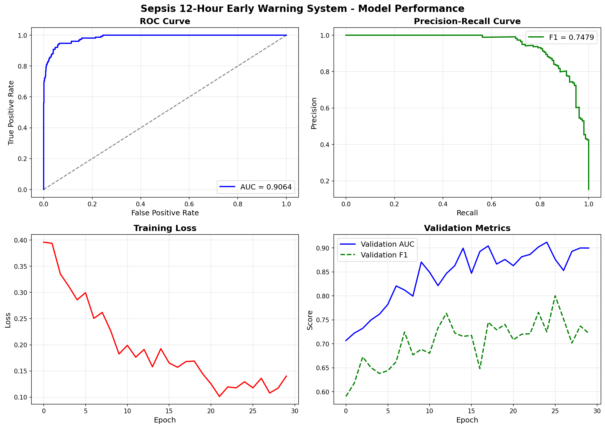

# 🏥 脓毒症12小时早期预警系统

<div align="center">


**基于深度学习的ICU患者脓毒症早期预警系统**

[功能特点](#-功能特点) • [系统架构](#-系统架构) • [快速开始](#-快速开始) • [性能指标](#-性能指标) • [API文档](#-api文档)

</div>

---

## 📋 项目简介

本系统是一个基于深度学习的脓毒症早期预警系统，能够在患者发病前**12小时**预测脓毒症风险，为临床干预争取宝贵时间。

### 核心特性

- 🔮 **12小时早期预警**：提前预测脓毒症风险
- 🧠 **深度学习模型**：BiLSTM + Attention架构
- 📊 **实时可视化**：直观展示预测结果和特征重要性
- 🔄 **可扩展设计**：支持替换任意训练模型
- 📈 **性能分析**：自动生成ROC曲线和性能图表

---

## 🏗️ 系统架构

```
┌─────────────────────────────────────────────────────────────────┐
│                        前端展示层                                │
│  ┌──────────────────────────────────────────────────────────┐  │
│  │  Flask + Chart.js                                        │  │
│  │  - 风险趋势图                                            │  │
│  │  - 生命体征监测                                          │  │
│  │  - 特征重要性（基于模型输出）                              │  │
│  │  - 预测原因分析                                          │  │
│  └──────────────────────────────────────────────────────────┘  │
└─────────────────────────────────────────────────────────────────┘
                              ↓ API调用
┌─────────────────────────────────────────────────────────────────┐
│                      Flask后端 (app.py)                         │
│  ┌──────────────────────────────────────────────────────────┐  │
│  │  /api/start/<scenario>  开始模拟                         │  │
│  │  /api/next/<pid>        生成下一小时数据                  │  │
│  │  /api/status            获取模型状态                     │  │
│  │  /api/performance       获取性能指标                     │  │
│  └──────────────────────────────────────────────────────────┘  │
└─────────────────────────────────────────────────────────────────┘
                              ↓ 调用
┌─────────────────────────────────────────────────────────────────┐
│                      核心逻辑层                                  │
│  ┌─────────────────┐  ┌─────────────────┐  ┌────────────────┐  │
│  │  数据生成       │  │  模型预测       │  │  结果分析      │  │
│  │  gen_patient()  │→│  do_predict()   │→│  基于模型输出  │  │
│  │  gen_hour()     │  │                 │  │  生成分析文本  │  │
│  └─────────────────┘  └─────────────────┘  └────────────────┘  │
└─────────────────────────────────────────────────────────────────┘
                              ↓ 使用
┌─────────────────────────────────────────────────────────────────┐
│                      模型层 (SepsisLSTM)                        │
│  ┌──────────────────────────────────────────────────────────┐  │
│  │  输入: [batch, 12, 12] (12时间步 × 12生理指标)           │  │
│  │  架构: LayerNorm → BiLSTM → Attention → Classifier       │  │
│  │  输出: 脓毒症概率 (0-1)                                  │  │
│  └──────────────────────────────────────────────────────────┘  │
└─────────────────────────────────────────────────────────────────┘
```

---

## 🚀 快速开始

### 环境要求

```bash
Python >= 3.10
PyTorch >= 2.0
Flask >= 3.0
scikit-learn
matplotlib
numpy
pandas
```

### 安装依赖

```bash
pip install torch flask scikit-learn matplotlib numpy pandas
```

### 启动系统

```bash
cd sepsis-early-warning
python3 app.py
```

访问：http://127.0.0.1:5001/

---

## 📊 性能指标

### 模型性能

| 指标 | 值 | 说明 |
|------|-----|------|
| **AUC-ROC** | 0.9064 | 综合判别能力 |
| **F1-Score** | 0.7479 | 精确率与召回率平衡 |
| **Precision** | 0.8225 | 预测准确率 |
| **Recall** | 0.6857 | 检出率 |

### 数据集统计

| 数据集 | 患者数 | 记录数 | 阳性率 |
|--------|--------|--------|--------|
| 训练集 | 3,500 | 91,597 | 10.8% |
| 验证集 | 750 | 20,012 | 12.3% |
| 测试集 | 750 | 19,518 | 10.1% |
| **总计** | **5,000** | **131,127** | **14.4%** |

### 性能图表

#### ROC曲线与PR曲线


#### 预测分布与指标汇总


---

## 🧠 模型架构

### SepsisLSTM

```python
class SepsisLSTM(nn.Module):
    def __init__(self, input_dim=12, hidden_dim=64, num_layers=2, dropout=0.4):
        super().__init__()
        # LayerNorm标准化
        self.norm = nn.LayerNorm(input_dim)
        
        # 双向LSTM
        self.lstm = nn.LSTM(
            input_dim, hidden_dim, num_layers,
            batch_first=True, bidirectional=True,
            dropout=dropout
        )
        
        # 时序注意力
        self.attn = Attention(hidden_dim)
        
        # 分类器（3层）
        self.clf = nn.Sequential(
            nn.Linear(hidden_dim * 2, hidden_dim),
            nn.ReLU(), nn.Dropout(0.5),
            nn.Linear(hidden_dim, 32),
            nn.ReLU(), nn.Dropout(0.4),
            nn.Linear(32, 1),
            nn.Sigmoid()
        )
```

### 输入特征

| 特征 | 名称 | 单位 | 正常范围 |
|------|------|------|----------|
| HR | 心率 | bpm | 60-100 |
| O2Sat | 血氧饱和度 | % | 95-100 |
| Temp | 体温 | °C | 36.5-37.5 |
| SBP | 收缩压 | mmHg | 90-140 |
| MAP | 平均动脉压 | mmHg | 70-110 |
| DBP | 舒张压 | mmHg | 60-90 |
| Resp | 呼吸频率 | 次/分 | 12-20 |
| BaseExcess | 碱剩余 | mmol/L | -2 to 2 |
| HCO3 | 碳酸氢根 | mmol/L | 22-26 |
| FiO2 | 吸入氧浓度 | - | 0.21-1.0 |
| pH | pH值 | - | 7.35-7.45 |
| PaCO2 | 二氧化碳分压 | mmHg | 35-45 |

---

## 📁 项目结构

```
sepsis-early-warning/
├── app.py                    # Flask应用主文件
├── train_sepsis.py           # 模型训练脚本
├── retrain.py                # 重新训练脚本
├── model.py                  # 模型定义
├── regenerate_charts.py      # 重新生成图表
├── requirements.txt          # 依赖列表
├── README.md                 # 项目文档
├── templates/
│   ├── index.html            # 首页模板
│   └── monitoring.html       # 监测页面模板
├── models/
│   ├── sepsis_model.pt       # 训练好的模型
│   ├── norm_params.json      # 标准化参数
│   ├── feature_cols.pkl      # 特征列
│   ├── data_stats.json       # 数据统计
│   ├── test_results.json     # 测试结果
│   ├── performance.png       # 性能图表
│   └── prediction_analysis.png
└── docs/
    ├── performance.png       # 文档用图片
    └── prediction_analysis.png
```

---

## 🔌 API文档

### 1. 开始模拟

```
GET /api/start/<scenario>
```

**参数：**
- `scenario`: `normal` (正常患者) 或 `sepsis` (脓毒症患者)

**响应：**
```json
{
  "ok": true,
  "data": {
    "pid": "ICU_194539",
    "scenario": "sepsis",
    "hour": 0,
    "time": "03-19 19:45",
    "vitals": {
      "HR": 82.5,
      "O2Sat": 97.2,
      "Temp": 36.8,
      ...
    },
    "risk": null,
    "level": "采集中",
    "attention": null,
    "importance": null,
    "reason_text": "⏳ 数据采集中..."
  }
}
```

### 2. 生成下一小时

```
GET /api/next/<pid>
```

**响应：**
```json
{
  "ok": true,
  "data": {
    "pid": "ICU_194539",
    "hour": 12,
    "vitals": {...},
    "risk": 0.8777,
    "level": "高风险",
    "attention": [0.083, 0.083, ...],
    "importance": {"HR": 0.5, "O2Sat": 1.0, ...},
    "reason_text": "<strong>12小时预警: 🚨 高风险</strong>..."
  }
}
```

### 3. 获取状态

```
GET /api/status
```

**响应：**
```json
{
  "model": true,
  "device": "cuda",
  "patients": 1
}
```

---

## 🔄 替换模型

本系统支持替换任意训练模型，只需：

### 1. 训练新模型

```python
# 使用自定义数据和参数
from train_sepsis import SepsisLSTM, train

model = SepsisLSTM(input_dim=12, hidden_dim=64)
train(model, train_data, val_data, epochs=40)
```

### 2. 保存模型

```python
torch.save({
    'model_state_dict': model.state_dict(),
    'config': {
        'input_dim': 12,
        'hidden_dim': 64,
        'num_layers': 2,
        'dropout': 0.4
    }
}, 'models/sepsis_model.pt')
```

### 3. 更新标准化参数

```python
# 保存新的标准化参数
norm_params = {
    'mean': train_df[FEATURES].mean().to_dict(),
    'std': train_df[FEATURES].std().to_dict()
}
with open('models/norm_params.json', 'w') as f:
    json.dump(norm_params, f)
```

### 4. 重启应用

```bash
python3 app.py
```

---

## 📈 训练模型

### 使用默认参数训练

```bash
python3 train_sepsis.py
```

### 自定义参数训练

```python
# 修改 train_sepsis.py 中的参数
TOTAL_PATIENTS = 10000  # 增加数据量
SEPSIS_RATE = 0.20      # 调整脓毒症率
SEQUENCE_LENGTH = 12    # 序列长度
EPOCHS = 50             # 训练轮数
```

### 重新训练

```bash
python3 retrain.py
```

---

## 🔬 数据生成逻辑

### 脓毒症恶化模型

```python
# 使用Sigmoid曲线模拟渐进恶化
progress = min(1.0, hours_sick / 20)
sigmoid = 1 / (1 + np.exp(-8 * (progress - 0.5)))

# 心率变化
HR = baseline + 20 * sigmoid + noise

# 血氧变化
O2Sat = baseline - 4 * sigmoid + noise

# 血压变化
SBP = baseline - 20 * sigmoid + noise
```

### 12小时预警标签

```python
# 从脓毒症发作前12小时到康复都标记为1
if hour >= onset - 12 and hour <= recovery:
    label = 1
else:
    label = 0
```

---

## ⚠️ 重要说明

1. **数据说明**：本系统使用模拟数据训练，基于MIMIC-III统计特征
2. **临床应用**：实际部署需在真实患者数据上验证
3. **模型局限**：12小时预警存在误报和漏报可能
4. **免责声明**：预测结果仅供参考，不构成医疗建议

---

## 📝 更新日志

### v2.0 (2024-03-19)
- ✅ 实现12小时早期预警
- ✅ 添加BiLSTM+Attention模型
- ✅ 支持模型替换
- ✅ 生成性能图表（英文标签）
- ✅ 优化数据生成逻辑

### v1.0 (2024-03-18)
- ✅ 基础脓毒症预测功能
- ✅ Flask Web界面
- ✅ 实时监测功能

---

## 📄 许可证

MIT License

---

## 👥 贡献

欢迎提交Issue和Pull Request！

---

<div align="center">

**如果这个项目对您有帮助，请给个 ⭐ Star！**

</div>
