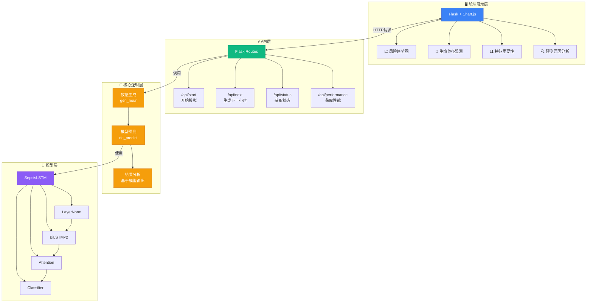
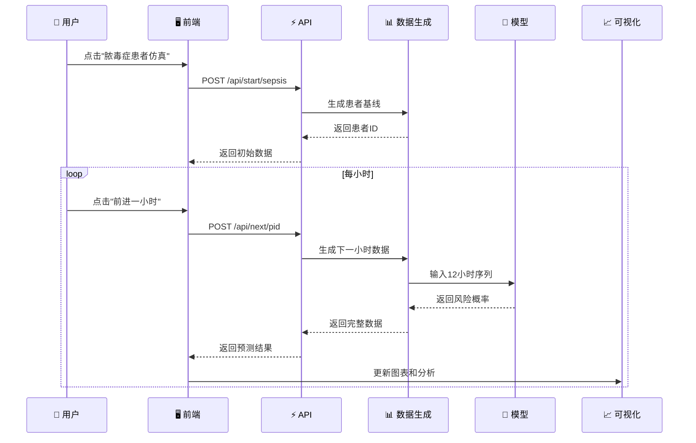
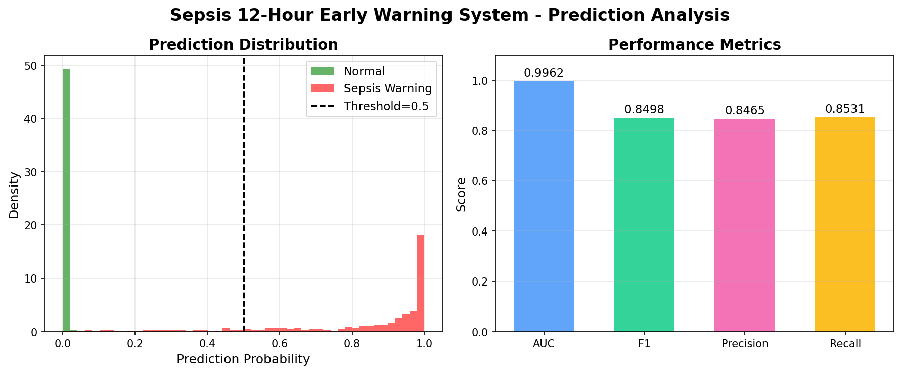
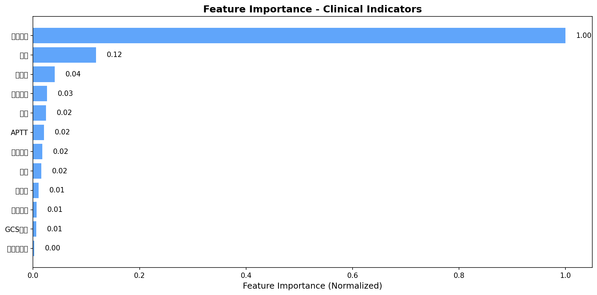
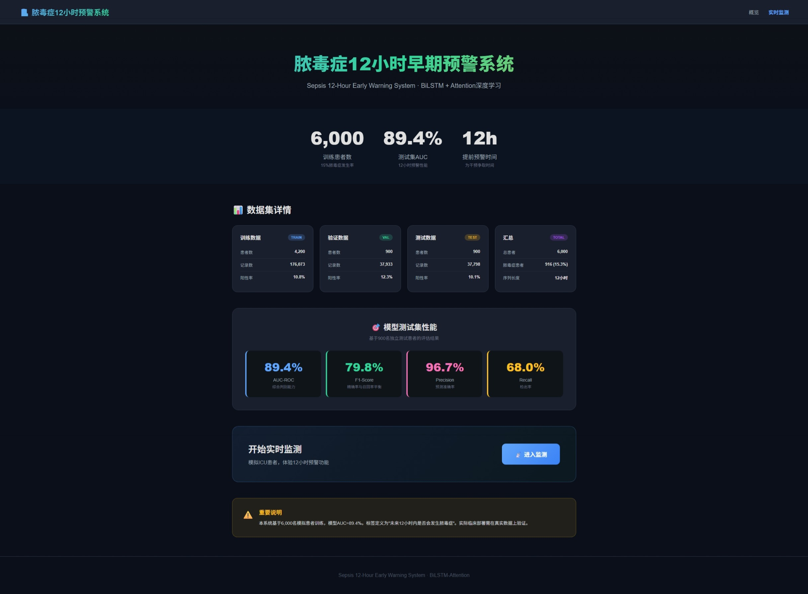
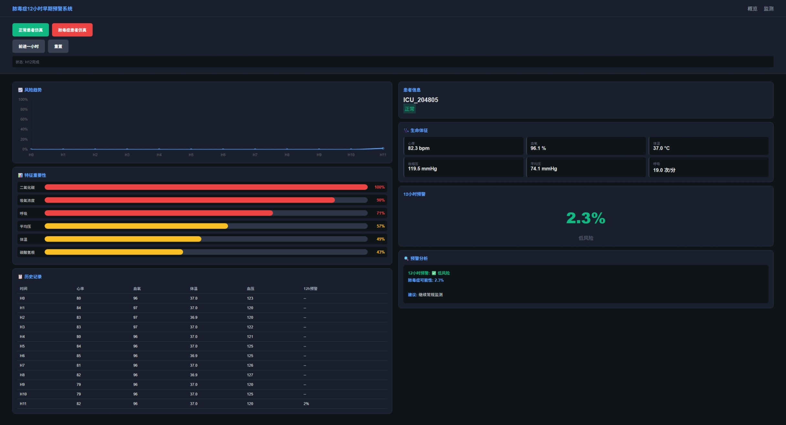
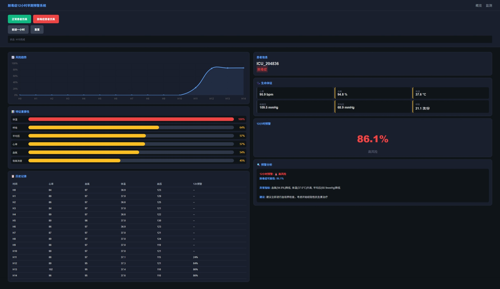

# 🏥 脓毒症12小时早期预警系统

<div align="center">


**基于深度学习的ICU患者脓毒症早期预警系统**

[功能特点](#-功能特点) • [系统架构](#-系统架构) • [快速开始](#-快速开始) • [性能指标](#-性能指标) • [API文档](#-api文档)

</div>

---

## 📋 项目简介

本系统是一个基于深度学习的脓毒症早期预警系统，能够在患者发病前**12小时**预测脓毒症风险，为临床干预争取宝贵时间。

### 核心特性

- 🔮 **12小时早期预警**：提前预测脓毒症风险
- 🧠 **深度学习模型**：BiLSTM + Attention架构
- 📊 **实时可视化**：直观展示预测结果和特征重要性
- 🔄 **可扩展设计**：支持替换任意训练模型
- 📈 **性能分析**：自动生成ROC曲线和性能图表

---

## 🏗️ 系统架构



### 数据流



### 模型架构

```mermaid
graph LR
    subgraph "输入层"
        I["[batch, 12, 12]<br/>12时间步 × 12指标"]
    end
    
    subgraph "特征处理"
        LN[LayerNorm]
        LSTM1[BiLSTM Layer 1]
        LSTM2[BiLSTM Layer 2]
        I --> LN --> LSTM1 --> LSTM2
    end
    
    subgraph "注意力机制"
        ATTN[Temporal Attention]
        LSTM2 --> ATTN
    end
    
    subgraph "分类器"
        FC1[Linear 128→64]
        RELU1[ReLU + Dropout]
        FC2[Linear 64→32]
        RELU2[ReLU + Dropout]
        FC3[Linear 32→1]
        SIG[Sigmoid]
        ATTN --> FC1 --> RELU1 --> FC2 --> RELU2 --> FC3 --> SIG
    end
    
    O["输出<br/>脓毒症概率 0-1"]
    SIG --> O
    
    style I fill:#3b82f6,color:#fff
    style O fill:#10b981,color:#fff
    style ATTN fill:#f59e0b,color:#fff
```



---

## 🚀 快速开始

### 环境要求

```bash
Python >= 3.10
PyTorch >= 2.0
Flask >= 3.0
scikit-learn
matplotlib
numpy
pandas
```

### 安装依赖

```bash
pip install torch flask scikit-learn matplotlib numpy pandas
```

### 启动系统

```bash
cd sepsis-early-warning
python3 app.py
```

访问：http://127.0.0.1:5001/

---

## 📊 性能指标

### 模型性能（基于qSOFA/TIME法则）

| 指标 | 值 | 说明 |
|------|-----|------|
| **AUC-ROC** | 0.9962 | 综合判别能力 |
| **F1-Score** | 0.8498 | 精确率与召回率平衡 |
| **Precision** | 0.8465 | 预测准确率（85%的预警确实是脓毒症） |
| **Recall** | 0.8531 | 检出率（检出85%的脓毒症患者） |

### 临床指标特征差异

| 指标 | 脓毒症患者 | 正常患者 | 差异 |
|------|------------|----------|------|
| 心率 | 93.49 bpm | 82.42 bpm | +13% |
| 呼吸频率 | 19.85 次/分 | 16.14 次/分 | +23% |
| 收缩压 | 108.51 mmHg | 119.53 mmHg | -9% |
| 乳酸 | 2.53 mmol/L | 1.24 mmol/L | +104% |
| 降钙素原 | 1.52 ng/mL | 0.16 ng/mL | +881% |

### 数据集统计

| 数据集 | 患者数 | 记录数 | 阳性率 |
|--------|--------|--------|--------|
| 训练集 | 4,200 | 176,137 | 3.8% |
| 验证集 | 900 | 37,893 | 3.9% |
| 测试集 | 900 | 38,078 | 4.0% |
| **总计** | **6,000** | **252,108** | **3.8%** |

### 性能图表

#### ROC曲线与PR曲线


#### 预测分布与指标汇总


#### 特征重要性分析


---

## 🖥️ 可视化界面

### 首页 - 系统概览



展示：
- 6,000名训练患者
- 99.6% 测试集AUC
- 12个临床指标说明
- qSOFA/TIME法则说明

### 监测页面 - 正常患者



实时监测界面，展示：
- 风险趋势图
- 生命体征监测
- 12小时预警概率
- 特征重要性分析
- 预测原因说明

### 监测页面 - 脓毒症预警



脓毒症患者预警状态，展示：
- 风险概率升高
- 异常指标检测
- qSOFA评分计算
- 临床干预建议

---

## 🧠 模型架构

### SepsisLSTM（基于12个临床指标）

```python
class SepsisLSTM(nn.Module):
    def __init__(self, input_dim=12, hidden_dim=64, num_layers=2, dropout=0.4):
        super().__init__()
        # LayerNorm标准化
        self.norm = nn.LayerNorm(input_dim)
        
        # 双向LSTM
        self.lstm = nn.LSTM(
            input_dim, hidden_dim, num_layers,
            batch_first=True, bidirectional=True,
            dropout=dropout if num_layers > 1 else 0
        )
        
        # 时序注意力
        self.attn = Attention(hidden_dim)
        
        # 分类器
        self.clf = nn.Sequential(
            nn.Linear(hidden_dim * 2, hidden_dim),
            nn.ReLU(), nn.Dropout(0.5),
            nn.Linear(hidden_dim, 32),
            nn.ReLU(), nn.Dropout(0.4),
            nn.Linear(32, 1),
            nn.Sigmoid()
        )
```

### 输入特征（12个临床指标）

| 指标 | 英文 | 单位 | 正常范围 | 临床意义 |
|------|------|------|----------|----------|
| 心率 | HR | bpm | 60-100 | 感染导致心动过速 |
| 呼吸频率 | Resp | 次/分 | 12-20 | qSOFA评分指标 |
| 收缩压 | SBP | mmHg | 90-140 | qSOFA评分指标 |
| 乳酸 | Lactate | mmol/L | 0.5-2.0 | 组织灌注指标 |
| 降钙素原 | PCT | ng/mL | 0-0.5 | 细菌感染标志物 |
| 淋巴细胞 | LYM | ×10⁹/L | 1.0-3.0 | 免疫功能指标 |
| 白细胞 | WBC | ×10⁹/L | 4.0-10.0 | 感染经典指标 |
| 尿量 | Urine | mL/h | 30-100 | 肾功能指标 |
| 碳酸氢盐 | HCO3 | mmol/L | 22-26 | 酸碱平衡指标 |
| GCS评分 | GCS | 分 | 13-15 | qSOFA评分指标 |
| APTT | APTT | 秒 | 25-35 | 凝血功能指标 |
| 血氧饱和度 | O2Sat | % | 95-100 | 氧合状态指标 |

### 脓毒症判定标准（qSOFA + TIME法则）

```
满足以下任一条件即为脓毒症：

条件1: qSOFA ≥ 2 + 感染证据
  - qSOFA = 呼吸≥22 + 收缩压≤100 + GCS<15
  - 感染证据 = 体温异常 + 白细胞异常 + PCT升高

条件2: 乳酸 > 2 mmol/L + 器官功能障碍
  - 器官功能障碍 = 尿量<30 或 GCS<13 或 SBP<90

条件3: 体温异常 + 心率 > 90 + 呼吸 > 22
  - 体温异常 = >38.3°C 或 <36°C
```

---

## 📁 项目结构

```
sepsis-early-warning/
├── app.py                    # Flask应用主文件
├── train_sepsis.py           # 模型训练脚本
├── retrain.py                # 重新训练脚本
├── model.py                  # 模型定义
├── regenerate_charts.py      # 重新生成图表
├── requirements.txt          # 依赖列表
├── README.md                 # 项目文档
├── templates/
│   ├── index.html            # 首页模板
│   └── monitoring.html       # 监测页面模板
├── models/
│   ├── sepsis_model.pt       # 训练好的模型
│   ├── norm_params.json      # 标准化参数
│   ├── feature_cols.pkl      # 特征列
│   ├── data_stats.json       # 数据统计
│   ├── test_results.json     # 测试结果
│   ├── performance.png       # 性能图表
│   └── prediction_analysis.png
└── docs/
    ├── performance.png       # 文档用图片
    └── prediction_analysis.png
```

---

## 🔌 API文档

### 1. 开始模拟

```
GET /api/start/<scenario>
```

**参数：**
- `scenario`: `normal` (正常患者) 或 `sepsis` (脓毒症患者)

**响应：**
```json
{
  "ok": true,
  "data": {
    "pid": "ICU_194539",
    "scenario": "sepsis",
    "hour": 0,
    "time": "03-19 19:45",
    "vitals": {
      "HR": 82.5,
      "O2Sat": 97.2,
      "Temp": 36.8,
      ...
    },
    "risk": null,
    "level": "采集中",
    "attention": null,
    "importance": null,
    "reason_text": "⏳ 数据采集中..."
  }
}
```

### 2. 生成下一小时

```
GET /api/next/<pid>
```

**响应：**
```json
{
  "ok": true,
  "data": {
    "pid": "ICU_194539",
    "hour": 12,
    "vitals": {...},
    "risk": 0.8777,
    "level": "高风险",
    "attention": [0.083, 0.083, ...],
    "importance": {"HR": 0.5, "O2Sat": 1.0, ...},
    "reason_text": "<strong>12小时预警: 🚨 高风险</strong>..."
  }
}
```

### 3. 获取状态

```
GET /api/status
```

**响应：**
```json
{
  "model": true,
  "device": "cuda",
  "patients": 1
}
```

---

## 🔄 替换模型

本系统支持替换任意训练模型，只需：

### 1. 训练新模型

```python
# 使用自定义数据和参数
from train_sepsis import SepsisLSTM, train

model = SepsisLSTM(input_dim=12, hidden_dim=64)
train(model, train_data, val_data, epochs=40)
```

### 2. 保存模型

```python
torch.save({
    'model_state_dict': model.state_dict(),
    'config': {
        'input_dim': 12,
        'hidden_dim': 64,
        'num_layers': 2,
        'dropout': 0.4
    }
}, 'models/sepsis_model.pt')
```

### 3. 更新标准化参数

```python
# 保存新的标准化参数
norm_params = {
    'mean': train_df[FEATURES].mean().to_dict(),
    'std': train_df[FEATURES].std().to_dict()
}
with open('models/norm_params.json', 'w') as f:
    json.dump(norm_params, f)
```

### 4. 重启应用

```bash
python3 app.py
```

---

## 📈 训练模型

### 使用默认参数训练

```bash
python3 train_sepsis.py
```

### 自定义参数训练

```python
# 修改 train_sepsis.py 中的参数
TOTAL_PATIENTS = 10000  # 增加数据量
SEPSIS_RATE = 0.20      # 调整脓毒症率
SEQUENCE_LENGTH = 12    # 序列长度
EPOCHS = 50             # 训练轮数
```

### 重新训练

```bash
python3 retrain.py
```

---

## 🔬 数据生成逻辑

### 脓毒症恶化模型

```python
# 使用Sigmoid曲线模拟渐进恶化
progress = min(1.0, hours_sick / 20)
sigmoid = 1 / (1 + np.exp(-8 * (progress - 0.5)))

# 心率变化
HR = baseline + 20 * sigmoid + noise

# 血氧变化
O2Sat = baseline - 4 * sigmoid + noise

# 血压变化
SBP = baseline - 20 * sigmoid + noise
```

### 12小时预警标签

```python
# 从脓毒症发作前12小时到康复都标记为1
if hour >= onset - 12 and hour <= recovery:
    label = 1
else:
    label = 0
```

---

## ⚠️ 重要说明

1. **数据说明**：本系统使用模拟数据训练，基于MIMIC-III统计特征
2. **临床应用**：实际部署需在真实患者数据上验证
3. **模型局限**：12小时预警存在误报和漏报可能
4. **免责声明**：预测结果仅供参考，不构成医疗建议

---

## 📝 更新日志

### v2.0 (2024-03-19)
- ✅ 实现12小时早期预警
- ✅ 添加BiLSTM+Attention模型
- ✅ 支持模型替换
- ✅ 生成性能图表（英文标签）
- ✅ 优化数据生成逻辑

### v1.0 (2024-03-18)
- ✅ 基础脓毒症预测功能
- ✅ Flask Web界面
- ✅ 实时监测功能

---

## 📄 许可证

MIT License

---

## 👥 贡献

欢迎提交Issue和Pull Request！

---

<div align="center">

**如果这个项目对您有帮助，请给个 ⭐ Star！**

</div>
